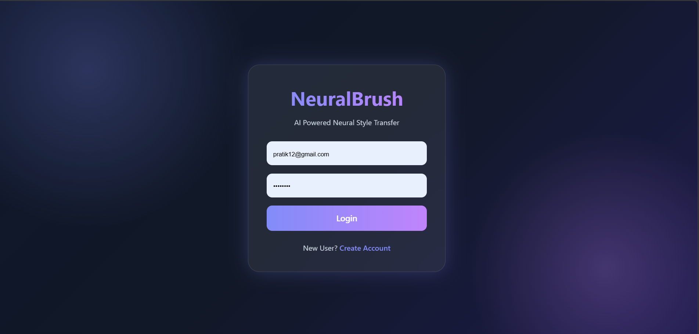
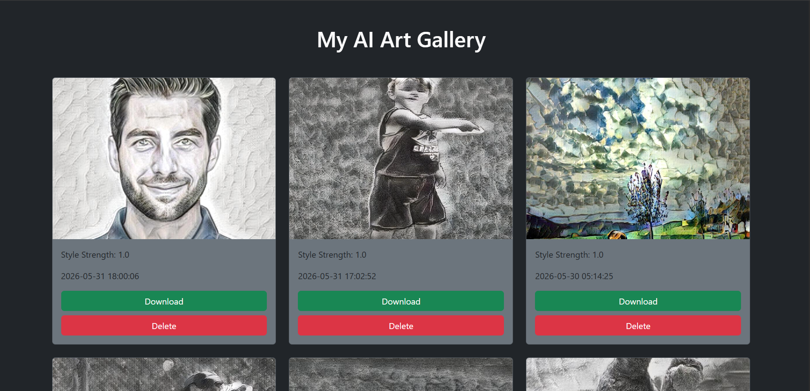
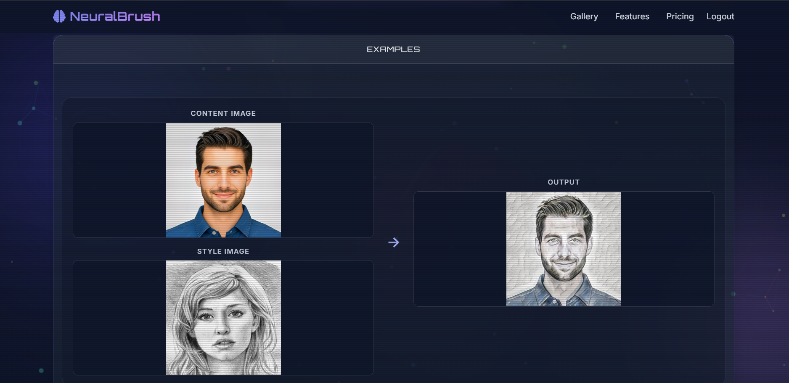

#  NeuralBrush - AI Style Transfer Platform

NeuralBrush is an AI-powered Neural Style Transfer web application that transforms ordinary images into artistic masterpieces using Deep Learning.

Built with PyTorch, Flask, MySQL, and Neural Style Transfer (AdaIN + VGG19).

---

##  Features

* AI Neural Style Transfer
* User Authentication (Login/Register)
* Gallery History
* Download Generated Images
* MySQL Database Integration
* Responsive Modern UI
* Adjustable Style Strength
* Before/After Comparison
* Flask Web Deployment

---

##  Tech Stack

### Backend

* Python
* Flask
* SQLAlchemy
* MySQL

### AI / Deep Learning

* PyTorch
* VGG19 Encoder
* AdaIN (Adaptive Instance Normalization)

### Frontend

* HTML5
* CSS3
* JavaScript
* Bootstrap

---

##  Screenshots

### Home Page

---

### Login Page

---

### Gallery

---

### Generated Result

---

##  Model Architecture

Content Image
↓
VGG19 Encoder
↓
Adaptive Instance Normalization (AdaIN)
↓
Decoder Network
↓
Stylized Output Image

---

##  Project Structure

NST_PROJECT/

├── app.py

├── database.py

├── train.py

├── utils/

├── templates/

├── static/

├── screenshots/

├── requirements.txt

└── README.md

---

##  Installation

### Clone Repository

git clone https://github.com/pratik-takale/NeuralBrush-AI-Style-Transfer.git

cd NeuralBrush-AI-Style-Transfer

### Install Dependencies

pip install -r requirements.txt

### Configure Environment Variables

Create .env file:

SECRET_KEY=your_secret_key

DB_USER=root

DB_PASSWORD=your_password

DB_NAME=neuralbrush

### Run Application

python app.py

Open:

http://127.0.0.1:5000

---

##  Future Improvements

* Transformer-based Style Transfer
* Stable Diffusion Integration
* Cloud Deployment
* Multiple Artistic Presets
* AI Dashboard Analytics

---

##  Author

Pratik Takale

Data Scientist | AI Developer | 

GitHub:
https://github.com/pratik-takale
